# AR Virtual Companion (FYP)


A comprehensive mobile AI companion application featuring AR character interaction, real-time voice chat, persona onboarding, diary/journal tracking, and a memory-aware AI backend generation system. 

This project was developed as a Final Year Project (FYP) for COMP S456F.

---

## 📸 App Screenshots

Here is a glimpse of the AR Virtual Companion's user interface and core features:

### 1. Onboarding & Personalization
<div align="center">
  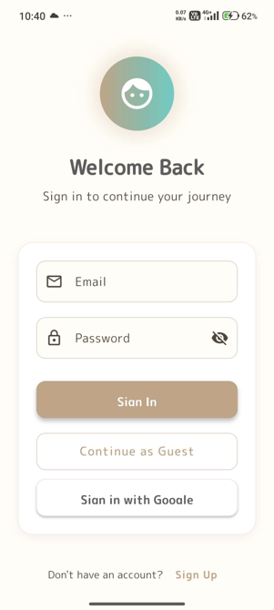
  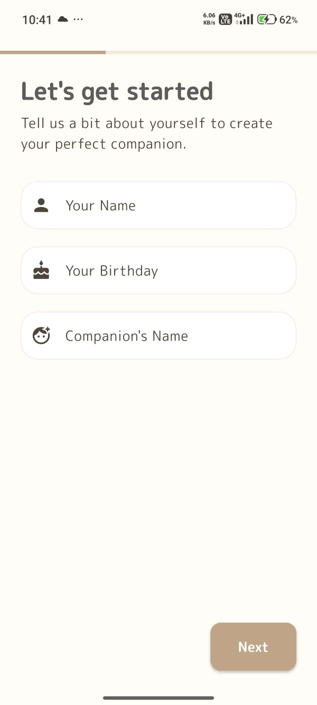
  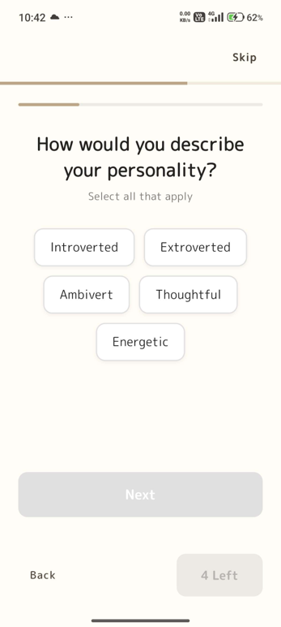
</div>
<div align="center">
  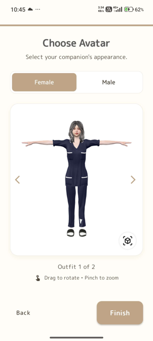
  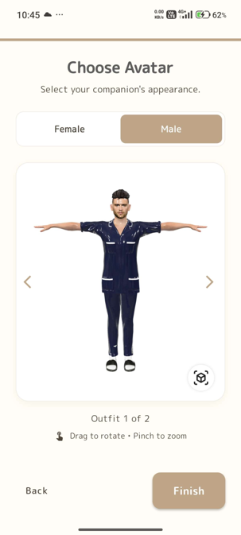
  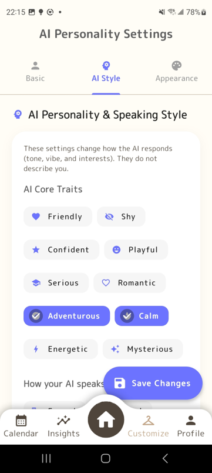
</div>

### 2. Dashboard & User Profile
<div align="center">
  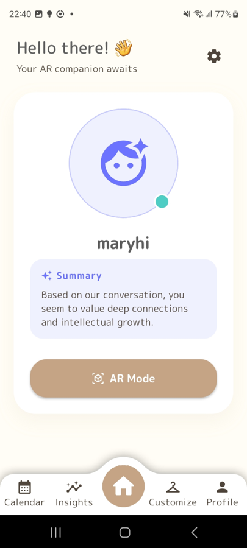
  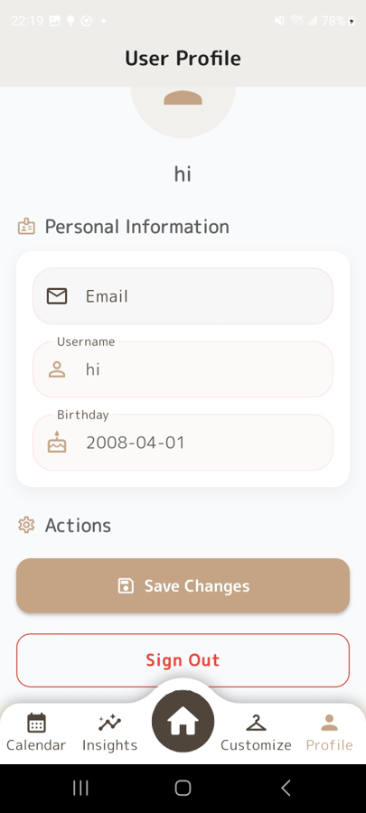
  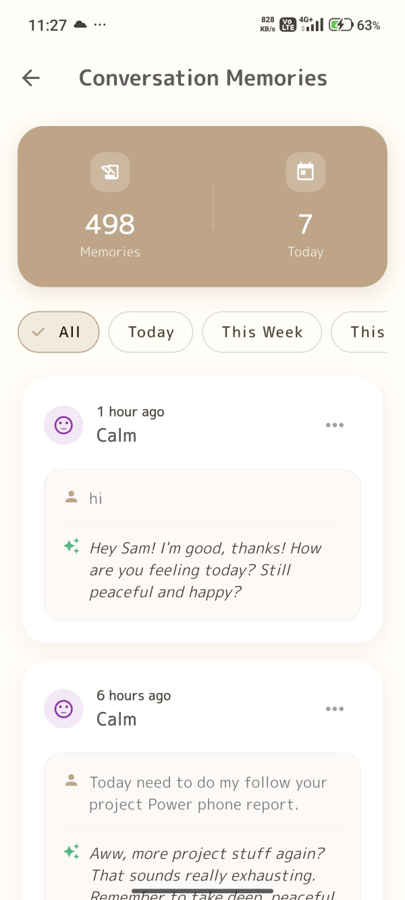
</div>

### 3. AR Interaction
<div align="center">
  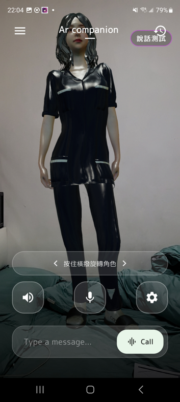
  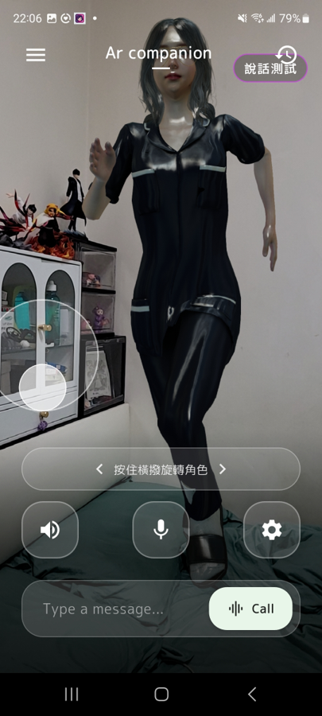
  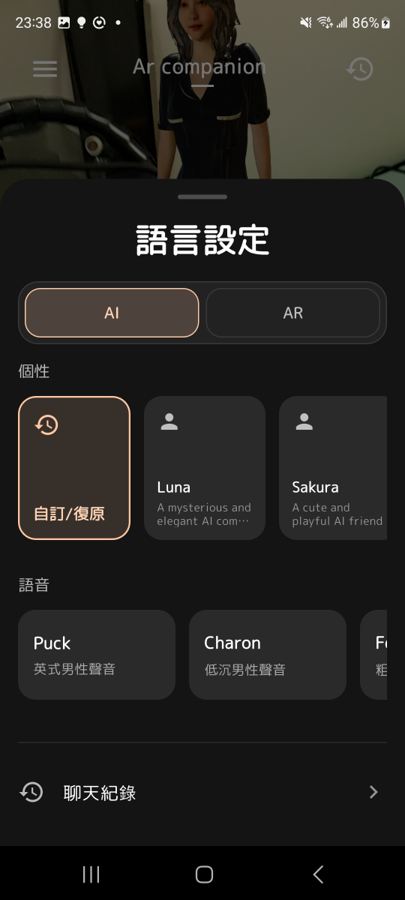
</div>

### 4. Journal & Insights
<div align="center">
  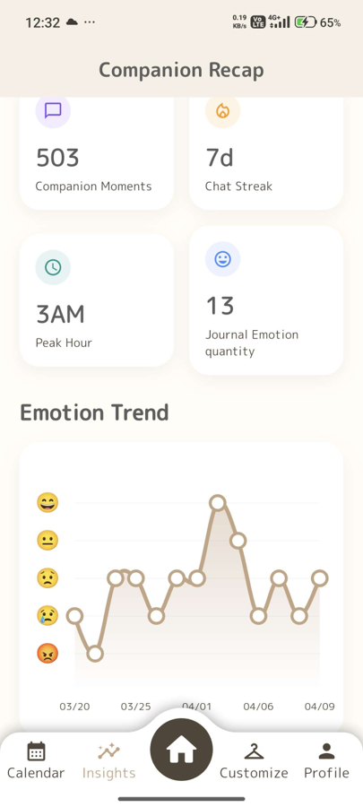
  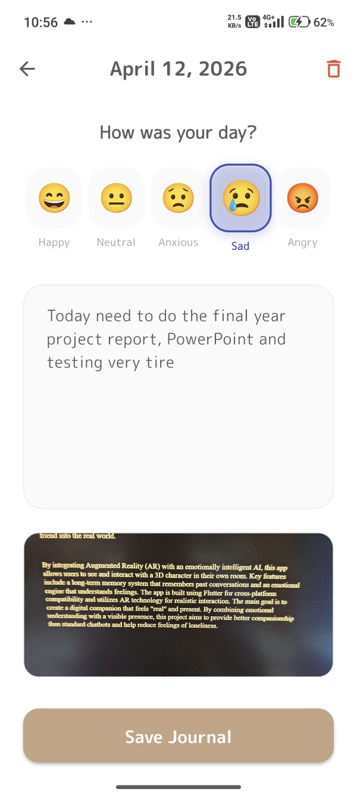
  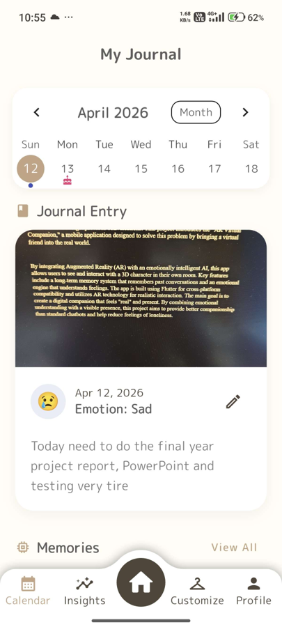
</div>

---

## 🚀 Live Demo & Hosting

- **Backend API (Hosted on Hugging Face)**: [Hugging Face Space Repository](https://huggingface.co/spaces/samlam123/Ai_companion/tree/main)
- **Database & Auth**: Supabase

---

## 🏗️ System Architecture

This repository is structured as a **Monorepo** containing both the Flutter frontend application and the FastAPI Python backend.

```text
.
├── ar_virtual_companion/       # Mobile App (Flutter)
│   ├── lib/                    # Frontend source code
│   ├── assets/                 # App icons, local placeholder images
│   └── pubspec.yaml
└── AI companion Backend hugging face space/ # Backend API (FastAPI)
    ├── main.py                 # API entry point
    ├── routes_*.py             # API routers (Chat, Memory, Persona)
    ├── Dockerfile              # Docker config for Hugging Face deployment
    └── requirements.txt        # Python dependencies
```

### High-Level Data Flow
1. **App Initialization**: The Flutter app authenticates users via Supabase Auth and loads user profiles/3D avatars.
2. **Real-time Interaction**: The app establishes a WebSocket connection (`routes_chat.py`) to the FastAPI backend.
3. **AI Processing**: The backend forwards audio/text to **Gemini Live**, injecting dynamic system prompts based on the user's selected persona and recent memories.
4. **Memory Management**: Chat history and daily journal entries are processed by **Groq** to extract stable facts and semantic summaries, embedded using **Jina API**, and stored in Supabase for long-term recall.

---

## 📱 Frontend (Flutter Mobile App)

Located in `ar_virtual_companion/`.

### Key Features
- **AR Interaction**: Render 3D `.glb` avatars in augmented reality using a customized `ar_flutter_plugin_2`.
- **Local Model Caching**: 3D models fetched from Supabase Storage are cached locally (10-year TTL) to minimize network egress and ensure instant AR loading times. Includes dynamic GLB height metrics estimation.
- **Real-time Voice Chat**: Low-latency PCM streaming playback (via SoLoud) connected to the backend's WebSocket.
- **Onboarding & Customization**: 3-step setup (Profile -> Persona Quiz -> Avatar Selection).
- **Journal & Analytics**: Daily mood tracking, journal entries (saved to Supabase), and weekly/monthly mood insights.
- **State Management & Services**: Built with `Riverpod` and `Provider`. Includes push notifications (scheduled daily/birthday/care messages), object detection (ML Kit), data export, and local caching services.

### Setup & Run
```bash
cd ar_virtual_companion
flutter pub get
flutter run
```
*Note: An AR-capable physical Android/iOS device is recommended for the full AR experience.*

---

## ⚙️ Backend (Python FastAPI)

Located in `AI companion Backend hugging face space/`.

### Key Features
- **Real-time Streaming**: `WS /v1/chat/live` endpoint for low-latency voice and text streaming via Gemini Live. Includes concurrent audio/text processing and client transcript relay.
- **Dynamic Persona & RAG**: Automatically constructs context-rich prompts (`ai_logic.py`) based on user profiles, recent conversations, and embedded memory facts. Features low-latency RAG injection while the user is still speaking.
- **Memory Engine**: Periodically summarizes and indexes long-term facts using Groq (Llama 3.1) and Jina Embeddings (`memory_logic.py`, `embedding_logic.py`).
- **Comfort System**: Analyzes journal entries to generate empathetic, persona-aligned comfort messages.
- **Caching & Pre-fetching**: Implements `cache_logic.py` to pre-load system prompts and user profiles to reduce latency during active sessions. Contains Thread-safe Database operations.

### Environment Variables
| Variable | Required | Purpose |
|---|---|---|
| `GEMINI_API_KEY` | Yes | Real-time voice and chat generation (Gemini Live) |
| `SUPABASE_URL` | Yes | Database connection |
| `SUPABASE_KEY` | Yes | Database connection |
| `GROQ_API_KEY` | Optional | Persona analysis, memory summarization, comfort texts |
| `JINA_API_KEY` | Optional | Embeddings for semantic memory retrieval |

### Local Setup & Run
```bash
cd "AI companion Backend hugging face space"
python -m venv .venv
# Activate venv (Windows: .venv\Scripts\activate | Mac/Linux: source .venv/bin/activate)
pip install -r requirements.txt

# Set your .env variables here

uvicorn main:app --host 0.0.0.0 --port 8000 --reload
```

---


## 🛠️ Tech Stack

**Frontend**: Flutter, Dart, Riverpod, `ar_flutter_plugin_2`
**Backend**: Python 3.11, FastAPI, Uvicorn, WebSockets
**AI / ML**: Google GenAI SDK (Gemini Live), Groq SDK (LLaMA 3), Jina Embeddings
**Database / Storage**: Supabase (PostgreSQL, Auth, Storage)

---

## 📝 License
Developed for Academic Purposes (FYP).